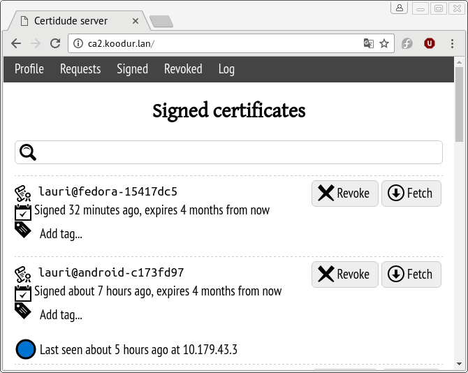
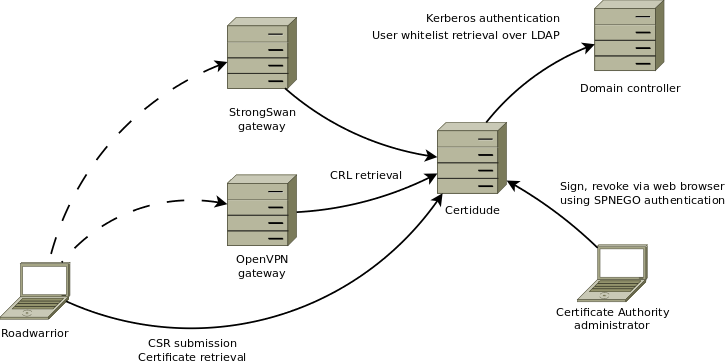

Certidude
=========

.. image:: https://travis-ci.org/laurivosandi/certidude.svg?branch=master
    :target: https://travis-ci.org/laurivosandi/certidude

.. image:: http://codecov.io/github/laurivosandi/certidude/coverage.svg?branch=master
    :target: http://codecov.io/github/laurivosandi/certidude?branch=master

Introduction
------------

Certidude is a minimalist X.509 Certificate Authority management tool
with Kerberos authentication mainly designed for OpenVPN gateway operators to make
VPN client setup on laptops, desktops and mobile devices as painless as possible.

Certidude can also be used to manage IPSec certifcates (StrongSwan)
or HTTPS client certificates to limit access to eg. intranet websites.
For a full-blown CA you might want to take a look at
`EJBCA <http://www.ejbca.org/features.html>`_ or
`OpenCA <https://pki.openca.org/>`_.

Usecases
--------

Following usecases are covered:

* I am a sysadmin. Employees with different operating systems need to access
  internal network services over OpenVPN.
  I want to provide web interface for submitting the certificate signing request online.
  I want to get notified via e-mail when a user submits a certificate.
  Once I have signed the certificate I want the user to have easy way to download
  the signed certificate from the same web interface.
  Request submission and signing has to be visible in the web interface
  immediately. Common name is set to username.

* I am a sysadmin. I want to allow my Ubuntu roadwarriors to
  connect to network services at headquarters via IPSec.
  I want to make use of domain membership trust to automatically sign the certificates.
  Common name is set to computers hostname without the domain suffix.
  NetworkManager integration is necessary so the user can see the VPN connection state.
  Software installation and one simple configuration file should suffice to get up and running.

* I am a sysadmin. Employees need to get access to intranet wiki using
  HTTPS certificates possibly with multiple devices.
  Common name is set to username@device-identifier.
  The user logs in using domain account in the web interface and can automatically
  retrieve a P12 bundle which can be installed on her Android device.

Features
--------

Common:

* Standard request, sign, revoke workflow via web interface.
* `OCSP <https://tools.ietf.org/html/rfc4557>`_ and `SCEP <https://tools.ietf.org/html/draft-nourse-scep-23>`_ support.
* PAM and Active Directory compliant authentication backends: Kerberos single sign-on, LDAP simple bind.
* POSIX groups and Active Directory (LDAP) group membership based authorization.
* Server-side command-line interface, check out ``certidude list``, ``certidude sign`` and ``certidude revoke``.
* Certificate serial numbers are intentionally randomized to avoid leaking information about business practices.
* Server-side events support via `nchan <https://nchan.slact.net/>`_.
* E-mail notifications about pending, signed, revoked, renewed and overwritten certificates.
* Built using compilation-free `oscrypto <https://github.com/wbond/oscrypto>`_ library.
* Object tagging, attach metadata to certificates using extended filesystem attributes.

Virtual private networking:

* Send VPN profile URL tokens via e-mail, for simplified VPN adoption on Android, iOS, Windows, Mac OS X and Ubuntu.
* OpenVPN gateway and roadwarrior integration, check out ``certidude setup openvpn server`` and ``certidude setup openvpn client``.
* StrongSwan gateway and roadwarrior integration, check out ``certidude setup strongswan server`` and ``certidude setup strongswan client``.
* NetworkManager integration for Ubuntu and Fedora, check out ``certidude setup openvpn networkmanager`` and ``certidude setup strongswan networkmanager``.

HTTPS:

* P12 bundle generation for web browsers, seems to work well with Android
* HTTPS server setup with client verification, check out ``certidude setup nginx``

Install
-------

To install Certidude server you need certain system libraries in addition to
regular Python dependencies.

System dependencies for Ubuntu 16.04:

.. code:: bash

    apt install -y \
        python3-click \
        python3-jinja2 python3-markdown \
        python3-pip \
        python3-mysql.connector python3-requests \
        python3-pyxattr

System dependencies for Fedora 25+:

.. code:: bash

    yum install redhat-rpm-config python-devel openssl-devel openldap-devel

At the moment package at PyPI is rather outdated.
Please proceed down to `Development <#development>`_ section to install Certidude from source.

Setting up authority
--------------------

First make sure the machine used for certificate authority has fully qualified
domain name set up properly.
You can check it with:

.. code:: bash

    hostname -f

The command should return ``ca.example.com``.

If necessary tweak machine's fully qualified hostname in ``/etc/hosts``:

.. code::

    127.0.0.1 localhost
    127.0.1.1 ca.example.com ca

Certidude can set up certificate authority relatively easily.
Following will set up certificate authority in ``/var/lib/certidude/hostname.domain.tld``,
configure systemd service for your platform,
nginx in ``/etc/nginx/sites-available/certidude.conf``,
cronjobs in ``/etc/cron.hourly/certidude`` and much more:

.. code:: bash

    certidude setup authority

Tweak the configuration in ``/etc/certidude/server.conf`` until you meet your requirements
and start the services:

.. code:: bash

    systemctl restart certidude

Certidude will submit e-mail notifications to locally running MTA.
Install Postfix and configure it as Satellite system:

.. code:: bash

    apt install postfix

Setting up PAM authentication
-----------------------------

Following assumes the OS user accounts are used to authenticate users.
This means users can be easily managed with OS tools such as ``adduser``, ``usermod``, ``userdel`` etc.

Make sure you insert `AllowUsers administrator-account-username`
to SSH server configuration if you have SSH server installed on the machine
to prevent regular users from accessing the command line of certidude.
Note that in future we're planning to add command-line interaction
in which case SSH access makes sense.

If you're planning to use PAM for authentication you need to install corresponding
Python modules:

.. code:: bash

    pip3 install simplepam

The default configuration generated by ``certidude setup`` should make use of the
PAM.

Setting up Active Directory authentication
------------------------------------------

Following assumes you have already set up Kerberos infrastructure and
Certidude is simply one of the servers making use of that infrastructure.

Install additional dependencies:

.. code:: bash

    apt-get install samba-common-bin krb5-user ldap-utils python-gssapi

Reset Samba client configuration in ``/etc/samba/smb.conf``, adjust
workgroup and realm accordingly:

.. code:: ini

    [global]
    security = ads
    netbios name = CA
    workgroup = EXAMPLE
    realm = EXAMPLE.COM
    kerberos method = system keytab

Reset Kerberos client configuration in ``/etc/krb5.conf``:

.. code:: ini

    [libdefaults]
    default_realm = EXAMPLE.COM
    dns_lookup_realm = true
    dns_lookup_kdc = true

Initialize Kerberos credentials:

.. code:: bash

    kinit administrator

Join the machine to domain:

.. code:: bash

    net ads join -k

Set up Kerberos keytab for the web service:

.. code:: bash

    KRB5_KTNAME=FILE:/etc/certidude/server.keytab net ads keytab add HTTP -k
    chown root:certidude /etc/certidude/server.keytab
    chmod 640 /etc/certidude/server.keytab

Reconfigure /etc/certidude/server.conf so ``kerberos`` backend is used for authentication,
and ``ldap`` backend is used for accoutns and authorization.
Adjust related options as necessary.
Also make sure there is cron.hourly job for creating GSSAPI credential cache -
that's necessary for querying LDAP using Certidude machine's credentials.

Common pitfalls:

* Following error message may mean that the IP address of the web server does not match the IP address used to join
  the CA machine to domain, eg when you're running CA behind SSL terminating web server:
  Bad credentials: Unspecified GSS failure.  Minor code may provide more information (851968)

Setting up services
-------------------

Set up services as usual (OpenVPN, Strongswan, etc), when setting up certificates
generate signing request with TLS server flag set.
See Certidude admin interface how to submit CSR-s and retrieve signed certificates.

Setting up clients
------------------

This example works for Ubuntu 16.04 desktop with corresponding plugins installed
for NetworkManager.

Configure Certidude client in ``/etc/certidude/client.conf``:

.. code:: ini

    [ca.example.com]
    insecure = true
    trigger = interface up

Configure services in ``/etc/certidude/services.conf``:

.. code:: bash

    [gateway.example.com]
    authority = ca.example.com
    service = network-manager/openvpn
    remote = gateway.example.com

To request certificate:

.. code:: bash

    certidude request

The keys, signing requests, certificates and CRL-s are placed under
/var/lib/certidude/ca.example.com/

The VPN connection should immideately become available under network connections.

Development
-----------

To use dependencies from pip:

.. code:: bash

    apt install \
        build-essential python-dev cython libffi-dev libssl-dev libkrb5-dev \
        ldap-utils krb5-user \
        libsasl2-modules-gssapi-mit \
        libsasl2-dev libldap2-dev

Clone the repository:

.. code:: bash

    git clone https://github.com/laurivosandi/certidude
    cd certidude

Install dependencies as shown above and additionally:

.. code:: bash

    pip3 install -r requirements.txt

To install the package from the source tree:

.. code:: bash

    pip3 install -e .

To run tests and measure code coverage grab a clean VM or container:

.. code:: bash

    pip3 install codecov pytest-cov
    rm .coverage*
    TRAVIS=1 coverage run --parallel-mode --source certidude -m py.test tests
    coverage combine
    coverage report

To uninstall:

.. code:: bash

    pip3 uninstall certidude

Certificate attributes
----------------------

Certificates have a lot of fields that can be filled in.
In any case country, state, locality, organization, organizational unit are not filled in
as this information will already exist in AD and duplicating it in the certificate management
doesn't make sense. Additionally the information will get out of sync if
attributes are changed in AD but certificates won't be updated.

If machine is enrolled, eg by running ``certidude request`` as root on Ubuntu/Fedora/Mac OS X:

* If Kerberos credentials are presented machine can be automatically enrolled depending on the ``machine enrollment`` setting
* Common name is set to short ``hostname``
* It is tricky to determine user who is triggering the action so given name, surname and e-mail attributes are not filled in

If user enrolls, eg by clicking generate bundle button in the web interface:

* Common name is either set to ``username`` or ``username@device-identifier`` depending on the ``user enrollment`` setting
* Given name and surname are not filled in because Unicode characters cause issues in OpenVPN Connect app
* E-mail is not filled in because it might change in AD
